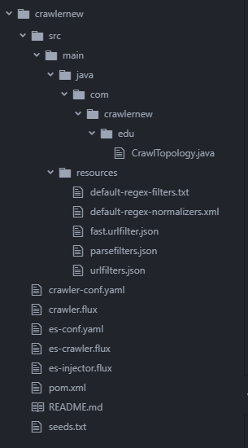

## Storm Crawler Documentation

Main configuration includes 

* crawler-conf.yaml
* es-crawler.flux
* es-injector.flux
* es-conf.yaml
* pom.xml
* seeds.txt
* crawltopology.java
* fast.urlfilter.json
* urlfilter.json



### crawler-conf.yaml
```
config: 
  topology.workers: 1
  topology.message.timeout.secs: 300
  topology.max.spout.pending: 100
  topology.debug: false

  fetcher.threads.number: 50
  
  # give 2gb to the workers
  worker.heap.memory.mb: 2048

  # mandatory when using Flux
  topology.kryo.register:
    - com.digitalpebble.stormcrawler.Metadata

  # metadata to transfer to the outlinks
  # used by Fetcher for redirections, sitemapparser, etc...
  # these are also persisted for the parent document (see below)
  # metadata.transfer:
  # - customMetadataName
  metadata.transfer:
   - seed

  # lists the metadata to persist to storage
  # these are not transfered to the outlinks
  metadata.persist:
   - _redirTo
   - error.cause
   - error.source
   - isSitemap
   - isFeed

  http.agent.name: "Anonymous Coward"
  http.agent.version: "1.0"
  http.agent.description: "built with StormCrawler Archetype 1.13"
  http.agent.url: "http://someorganization.com/"
  http.agent.email: "someone@someorganization.com"

  # The maximum number of bytes for returned HTTP response bodies.
  # The fetched page will be trimmed to 65KB in this case
  # Set -1 to disable the limit.
  http.content.limit: -1
  jsoup.treat.non.html.as.error: false

  # FetcherBolt queue dump => comment out to activate
  # if a file exists on the worker machine with the corresponding port number
  # the FetcherBolt will log the content of its internal queues to the logs
  # fetcherbolt.queue.debug.filepath: "/tmp/fetcher-dump-{port}"

  parsefilters.config.file: "parsefilters.json"
  urlfilters.config.file: "urlfilters.json"

  # revisit a page daily (value in minutes)
  # set it to -1 to never refetch a page
  fetchInterval.default: 1440

  # revisit a page with a fetch error after 2 hours (value in minutes)
  # set it to -1 to never refetch a page
  fetchInterval.fetch.error: 120

  # never revisit a page with an error (or set a value in minutes)
  fetchInterval.error: -1

  # text extraction for JSoupParserBolt
  textextractor.include.pattern:
   - DIV[id="maincontent"]
   - DIV[itemprop="articleBody"]
   - ARTICLE

  textextractor.exclude.tags:
   - STYLE
   - SCRIPT

  # custom fetch interval to be used when a document has the key/value in its metadata
  # and has been fetched successfully (value in minutes)
  # fetchInterval.FETCH_ERROR.isFeed=true: 30
  # fetchInterval.isFeed=true: 10

  # configuration for the classes extending AbstractIndexerBolt
  # indexer.md.filter: "someKey=aValue"
  indexer.url.fieldname: "url"
  indexer.text.fieldname: "content"
  indexer.canonical.name: "canonical"
  indexer.md.mapping:
  - parse.title=title
  - parse.keywords=keywords
  - parse.description=description
  - domain=domain
  - seed=seed

  # Metrics consumers:
  topology.metrics.consumer.register:
     - class: "org.apache.storm.metric.LoggingMetricsConsumer"
       parallelism.hint: 1
```
 By Default for every 19 hours crawler rechecks the page. You can increase or decrease this interval limit by changing **fetchInterval.default** value in *crawler.conf.yaml* . 

### es-crawler.flux
```
name: "Crawler"

includes:
    - resource: true
      file: "/crawler-default.yaml"
      override: false

    - resource: false
      file: "crawler-conf.yaml"
      override: true

    - resource: false
      file: "es-conf.yaml"
      override: true

spouts:
  - id: "spout"
    className: "com.digitalpebble.stormcrawler.elasticsearch.persistence.AggregationSpout"
    parallelism: 10

bolts:
  - id: "partitioner"
    className: "com.digitalpebble.stormcrawler.bolt.URLPartitionerBolt"
    parallelism: 1
  - id: "fetcher"
    className: "com.digitalpebble.stormcrawler.bolt.FetcherBolt"
    parallelism: 1
  - id: "sitemap"
    className: "com.digitalpebble.stormcrawler.bolt.SiteMapParserBolt"
    parallelism: 1
  - id: "parse"
    className: "com.digitalpebble.stormcrawler.bolt.JSoupParserBolt"
    parallelism: 1
  - id: "index"
    className: "com.digitalpebble.stormcrawler.elasticsearch.bolt.IndexerBolt"
    parallelism: 1
  - id: "status"
    className: "com.digitalpebble.stormcrawler.elasticsearch.persistence.StatusUpdaterBolt"
    parallelism: 1
  - id: "status_metrics"
    className: "com.digitalpebble.stormcrawler.elasticsearch.metrics.StatusMetricsBolt"
    parallelism: 1
  - id: "redirection_bolt"
    className: "com.digitalpebble.stormcrawler.tika.RedirectionBolt"
    parallelism: 1
  - id: "parser_bolt"
    className: "com.digitalpebble.stormcrawler.tika.ParserBolt"
    parallelism: 1 

streams:
  - from: "spout"
    to: "partitioner"
    grouping:
      type: SHUFFLE
      
  - from: "spout"
    to: "status_metrics"
    grouping:
      type: SHUFFLE     

  - from: "partitioner"
    to: "fetcher"
    grouping:
      type: FIELDS
      args: ["key"]

  - from: "fetcher"
    to: "sitemap"
    grouping:
      type: LOCAL_OR_SHUFFLE

  - from: "sitemap"
    to: "parse"
    grouping:
      type: LOCAL_OR_SHUFFLE

  - from: "parse"
    to: "index"
    grouping:
      type: LOCAL_OR_SHUFFLE

  - from: "fetcher"
    to: "status"
    grouping:
      type: FIELDS
      args: ["url"]
      streamId: "status"

  - from: "sitemap"
    to: "status"
    grouping:
      type: FIELDS
      args: ["url"]
      streamId: "status"

  - from: "parse"
    to: "status"
    grouping:
      type: FIELDS
      args: ["url"]
      streamId: "status"

  - from: "index"
    to: "status"
    grouping:
      type: FIELDS
      args: ["url"]
      streamId: "status"
  - from: "parse"
    to: "redirection_bolt"
    grouping:
      type: LOCAL_OR_SHUFFLE


  - from: "redirection_bolt"
    to: "parser_bolt"
    grouping:
      type: LOCAL_OR_SHUFFLE


  - from: "redirection_bolt"
    to: "index"
    grouping:
      type: LOCAL_OR_SHUFFLE


  - from: "parser_bolt"
    to: "index"
    grouping:
      type: LOCAL_OR_SHUFFLE

  - from: "redirection_bolt"
    to: "parser_bolt"
    grouping:
      type: LOCAL_OR_SHUFFLE
      streamId: "tika"
```
### es-injector.flux
```
name: "injector"

includes:
    - resource: true
      file: "/crawler-default.yaml"
      override: false

    - resource: false
      file: "crawler-conf.yaml"
      override: true

    - resource: false
      file: "es-conf.yaml"
      override: true

spouts:
  - id: "spout"
    className: "com.digitalpebble.stormcrawler.spout.FileSpout"
    parallelism: 1
    constructorArgs:
      - "."
      - "seeds.txt"
      - true

bolts:
  - id: "status"
    className: "com.digitalpebble.stormcrawler.elasticsearch.persistence.StatusUpdaterBolt"
    parallelism: 1
  - id: "parser_bolt"
    className: "com.digitalpebble.stormcrawler.tika.ParserBolt"
    parallelism: 1

streams:
  - from: "spout"
    to: "status"
    grouping:
      type: CUSTOM
      customClass:
        className: "com.digitalpebble.stormcrawler.util.URLStreamGrouping"
        constructorArgs:
          - "byHost"
      streamId: "status"
 ```
### es-conf.yaml
```
# configuration for Elasticsearch resources
  
config:
  # ES indexer bolt
  # adresses can be specified as a full URL
  # if not we assume that the protocol is http and the port 9200
  es.indexer.addresses: "https://elasticserver:9271"
  es.indexer.index.name: "index"
  # es.indexer.pipeline: "_PIPELINE_"
  #### Check the document type thoroughly it needs to match with the elastic search index mapping ####
  es.indexer.doc.type: "doc"
  es.status.user: "USERNAME"
  es.status.password: "PASSWORD"
  es.indexer.create: false
  #### Change the Cluster Name ####
  es.indexer.settings:
    cluster.name: "web"
  
  # ES metricsConsumer
  es.metrics.addresses: "https://elasticserver:9271"
  es.metrics.index.name: "metrics"
  #### Check the document type thoroughly it needs to match with the elastic search index mapping ####
  es.metrics.doc.type: "datapoint"
  es.status.user: "USERNAME"
  es.status.password: "PASSWORD"
  #### Change the Cluster Name ####
  es.metrics.settings:
    cluster.name: "web"
  
  # ES spout and persistence bolt
  es.status.addresses: "https://elasticserver:9271"
  es.status.index.name: "status"
  #### Check the document type thoroughly it needs to match with the elastic search index mapping ####
  es.status.doc.type: "status"
  es.status.user: "USERNAME"
  es.status.password: "PASSWORD"
  # the routing is done on the value of 'partition.url.mode'
  es.status.routing: true
  # stores the value used for the routing as a separate field
  # needed by the spout implementations
  es.status.routing.fieldname: "metadata.hostname"
  es.status.bulkActions: 500
  es.status.flushInterval: "5s"
  es.status.concurrentRequests: 1
  #### Change the Cluster Name ####
  es.status.settings:
    cluster.name: "web"
  
  ################
  # spout config #
  ################
  
  # positive or negative filter parsable by the Lucene Query Parser
  # es.status.filterQuery: "-(metadata.hostname:stormcrawler.net)"

  # time in secs for which the URLs will be considered for fetching after a ack of fail
  spout.ttl.purgatory: 30
  
  # Min time (in msecs) to allow between 2 successive queries to ES
  spout.min.delay.queries: 500

  # Delay since previous query date (in secs) after which the nextFetchDate value will be reset to the current time
  # Setting this to -1 or a large value means that the ES will cache the results but also that less and less results
  # might be returned.
  spout.reset.fetchdate.after: 120

  es.status.max.buckets: 50
  es.status.max.urls.per.bucket: 15
  # field to group the URLs into buckets
  es.status.bucket.field: "metadata.hostname"
  # field to sort the URLs within a bucket
  es.status.bucket.sort.field: "nextFetchDate"
  # field to sort the buckets
  es.status.global.sort.field: "nextFetchDate"

  # CollapsingSpout : limits the deep paging by resetting the start offset for the ES query 
  es.status.max.start.offset: 500
  
  # AggregationSpout : sampling improves the performance on large crawls
  es.status.sample: false

  # AggregationSpout (expert): adds this value in mins to the latest date returned in the results and
  # use it as nextFetchDate
  es.status.recentDate.increase: -1
  es.status.recentDate.min.gap: -1

  topology.metrics.consumer.register:
       - class: "com.digitalpebble.stormcrawler.elasticsearch.metrics.MetricsConsumer"
         parallelism.hint: 1
         #whitelist:
         #  - "fetcher_counter"
         #  - "fetcher_average.bytes_fetched"
         #blacklist:
         #  - "__receive.*"
```

### pom.xml
```
<project xmlns="http://maven.apache.org/POM/4.0.0" xmlns:xsi="http://www.w3.org/2001/XMLSchema-instance"
	xsi:schemaLocation="http://maven.apache.org/POM/4.0.0 http://maven.apache.org/maven-v4_0_0.xsd">

	<modelVersion>4.0.0</modelVersion>
	<groupId>com.crawlernew.edu</groupId>
	<artifactId>crawlernew</artifactId>
	<version>1.0-SNAPSHOT</version>
	<packaging>jar</packaging>

	<properties>
		<project.build.sourceEncoding>UTF-8</project.build.sourceEncoding>
		<stormcrawler.version>1.13</stormcrawler.version>
	</properties>

	<build>
		<plugins>
			<plugin>
				<groupId>org.apache.maven.plugins</groupId>
				<artifactId>maven-compiler-plugin</artifactId>
				<version>3.2</version>
				<configuration>
					<source>1.8</source>
					<target>1.8</target>
				</configuration>
			</plugin>
			<plugin>
				<groupId>org.codehaus.mojo</groupId>
				<artifactId>exec-maven-plugin</artifactId>
				<version>1.3.2</version>
				<executions>
					<execution>
						<goals>
							<goal>exec</goal>
						</goals>
					</execution>
				</executions>
				<configuration>
					<executable>java</executable>
					<includeProjectDependencies>true</includeProjectDependencies>
					<includePluginDependencies>false</includePluginDependencies>
					<classpathScope>compile</classpathScope>
				</configuration>
			</plugin>
			<plugin>
				<groupId>org.apache.maven.plugins</groupId>
				<artifactId>maven-shade-plugin</artifactId>
				<version>1.3.3</version>
				<executions>
					<execution>
						<phase>package</phase>
						<goals>
							<goal>shade</goal>
						</goals>
						<configuration>
							<createDependencyReducedPom>false</createDependencyReducedPom>
							<transformers>
								<transformer
									implementation="org.apache.maven.plugins.shade.resource.ServicesResourceTransformer" />
								<transformer
									implementation="org.apache.maven.plugins.shade.resource.ManifestResourceTransformer">
									<mainClass>org.apache.storm.flux.Flux</mainClass>
									<manifestEntries>
										<Change></Change>
										<Build-Date></Build-Date>
									</manifestEntries>
								</transformer>
							</transformers>
							<!-- The filters below are necessary if you want to include the Tika 
								module -->
							<filters>
								<filter>
									<artifact>*:*</artifact>
									<excludes>
										<exclude>META-INF/*.SF</exclude>
										<exclude>META-INF/*.DSA</exclude>
										<exclude>META-INF/*.RSA</exclude>
									</excludes>
								</filter>
								<filter>
									<!-- https://issues.apache.org/jira/browse/STORM-2428 -->
									<artifact>org.apache.storm:flux-core</artifact>
									<excludes>
										<exclude>org/apache/commons/**</exclude>
										<exclude>org/apache/http/**</exclude>
										<exclude>org/yaml/**</exclude>
									</excludes>
								</filter>
							</filters>
						</configuration>
					</execution>
				</executions>
			</plugin>
		</plugins>
	</build>

	<dependencies>
		<dependency>
			<groupId>com.digitalpebble.stormcrawler</groupId>
			<artifactId>storm-crawler-core</artifactId>
			<version>${stormcrawler.version}</version>
		</dependency>
		<dependency>
			<groupId>com.digitalpebble.stormcrawler</groupId>
			<artifactId>storm-crawler-elasticsearch</artifactId>
			<version>${stormcrawler.version}</version>
		</dependency>
		<dependency>
			<groupId>com.digitalpebble.stormcrawler</groupId>
			<artifactId>storm-crawler-tika</artifactId>
			<version>${stormcrawler.version}</version>
		</dependency>
		<dependency>
			<groupId>org.apache.storm</groupId>
			<artifactId>storm-core</artifactId>
			<version>1.2.2</version>
			<scope>provided</scope>
		</dependency>
		<dependency>
			<groupId>org.apache.storm</groupId>
			<artifactId>flux-core</artifactId>
			<version>1.2.2</version>
		</dependency>
	</dependencies>
</project>
```
### seeds.txt
* The below approach h is used to crawl the specific pages under main domain. For this, need to configure fast.urlfilter.json and urlfilter.json under /src/main/resources 
```
https://www.site1.edu/college1/	seed=college1
https://www.site1.edu/college2/	seed=college2
https://www.site1.edu/college3/	seed=college3
```
* For single website crawling without any filter just mention the url of the website
```
https://www.site1.edu/
```

### crawltoplology.java
```
package com.test.edu;

// Replace with maven generated java and don't change the package name keep the maven generated package name

import org.apache.storm.metric.LoggingMetricsConsumer;
import org.apache.storm.topology.TopologyBuilder;
import org.apache.storm.tuple.Fields;

import com.digitalpebble.stormcrawler.ConfigurableTopology;
import com.digitalpebble.stormcrawler.Constants;
import com.digitalpebble.stormcrawler.bolt.FetcherBolt;
import com.digitalpebble.stormcrawler.bolt.JSoupParserBolt;
import com.digitalpebble.stormcrawler.bolt.SiteMapParserBolt;
import com.digitalpebble.stormcrawler.bolt.URLPartitionerBolt;
import com.digitalpebble.stormcrawler.elasticsearch.bolt.DeletionBolt;
import com.digitalpebble.stormcrawler.elasticsearch.bolt.IndexerBolt;
import com.digitalpebble.stormcrawler.elasticsearch.metrics.MetricsConsumer;
import com.digitalpebble.stormcrawler.elasticsearch.persistence.CollapsingSpout;
import com.digitalpebble.stormcrawler.elasticsearch.metrics.StatusMetricsBolt;
import com.digitalpebble.stormcrawler.elasticsearch.persistence.StatusUpdaterBolt;
import com.digitalpebble.stormcrawler.tika.RedirectionBolt;
import com.digitalpebble.stormcrawler.tika.ParserBolt;


import com.digitalpebble.stormcrawler.util.ConfUtils;

public class CrawlTopology extends ConfigurableTopology {

    public static void main(String[] args) throws Exception {
        ConfigurableTopology.start(new CrawlTopology(), args);
    }

    @Override
    protected int run(String[] args) {
        TopologyBuilder builder = new TopologyBuilder();

        int numWorkers = ConfUtils.getInt(getConf(), "topology.workers", 1);

        // set to the real number of shards ONLY if es.status.routing is set to
        // true in the configuration
        int numShards = 1;

        builder.setSpout("spout", new CollapsingSpout(), numShards);

        builder.setBolt("status_metrics", new StatusMetricsBolt())
                .shuffleGrouping("spout");

        builder.setBolt("partitioner", new URLPartitionerBolt(), numWorkers)
                .shuffleGrouping("spout");

        builder.setBolt("fetch", new FetcherBolt(), numWorkers).fieldsGrouping(
                "partitioner", new Fields("key"));

        builder.setBolt("sitemap", new SiteMapParserBolt(), numWorkers)
                .localOrShuffleGrouping("fetch");

        builder.setBolt("parse", new JSoupParserBolt(), numWorkers)
                .localOrShuffleGrouping("sitemap");

        builder.setBolt("indexer", new IndexerBolt(), numWorkers)
                .localOrShuffleGrouping("parse");
				
		 builder.setBolt("jsoup", new JSoupParserBolt())
				.localOrShuffleGrouping(
          "sitemap");
  
		builder.setBolt("shunt", new RedirectionBolt()).localOrShuffleGrouping("jsoup");	
  
		builder.setBolt("tika", new ParserBolt()).localOrShuffleGrouping("shunt",
          "tika");
  
	

        Fields furl = new Fields("url");

        builder.setBolt("status", new StatusUpdaterBolt(), numWorkers)
                .fieldsGrouping("fetch", Constants.StatusStreamName, furl)
                .fieldsGrouping("sitemap", Constants.StatusStreamName, furl)
                .fieldsGrouping("parse", Constants.StatusStreamName, furl)
                .fieldsGrouping("indexer", Constants.StatusStreamName, furl)
                .fieldsGrouping("jsoup", Constants.StatusStreamName, furl)				
                .fieldsGrouping("shunt", Constants.StatusStreamName, furl)
				.fieldsGrouping("tika", Constants.StatusStreamName, furl);
        builder.setBolt("deleter", new DeletionBolt(), numWorkers)
                .localOrShuffleGrouping("status",
                        Constants.DELETION_STREAM_NAME);

        conf.registerMetricsConsumer(MetricsConsumer.class);
        conf.registerMetricsConsumer(LoggingMetricsConsumer.class);

        return submit("crawl", conf, builder);
    }
}
```
### fast.urlfilter.json
<!-- This filter configuration is used to enable the crawler to crawl only the specific pages added in seeds.txt -->
```
 [
     {
         "scope": "domain:site1.edu",
         "patterns": [
             "AllowPath /college1/",
             "AllowPath /college2/",
             "AllowPath /college3/",
              "DenyPath .+"
         ]
     }

 ]
```

### urlfilter.json

```
{
  "com.digitalpebble.stormcrawler.filtering.URLFilters": [
    {
      "class": "com.digitalpebble.stormcrawler.filtering.basic.BasicURLFilter",
      "name": "BasicURLFilter",
      "params": {
        "maxPathRepetition": 3,
        "maxLength": 1024
      }
    },
    {
      "class": "com.digitalpebble.stormcrawler.filtering.depth.MaxDepthFilter",
      "name": "MaxDepthFilter",
      "params": {
        "maxDepth": -1
      }
    },
    {
      "class": "com.digitalpebble.stormcrawler.filtering.basic.BasicURLNormalizer",
      "name": "BasicURLNormalizer",
      "params": {
        "removeAnchorPart": true,
        "unmangleQueryString": true,
        "checkValidURI": true,
        "removeHashes": false
      }
    },
    {
      "class": "com.digitalpebble.stormcrawler.filtering.host.HostURLFilter",
      "name": "HostURLFilter",
      "params": {
        "ignoreOutsideHost": true,
        "ignoreOutsideDomain": true
      }
    },
    {
      "class": "com.digitalpebble.stormcrawler.filtering.regex.RegexURLNormalizer",
      "name": "RegexURLNormalizer",
      "params": {
        "regexNormalizerFile": "default-regex-normalizers.xml"
      }
    },
  
  <!-- Enable the fast.urlfilter whenever you need to perform domain specific crawling -->
  
    {
      "class": "com.digitalpebble.stormcrawler.filtering.regex.FastURLFilter",
      "name": "FastURLFilter",
      "params": {
        "file": "fast.urlfilter.json"
      }
    },
     {
      "class": "com.digitalpebble.stormcrawler.filtering.regex.RegexURLFilter",
      "name": "RegexURLFilter",
      "params": {
        "regexFilterFile": "default-regex-filters.txt"
      }
    },
    {
      "class": "com.digitalpebble.stormcrawler.filtering.basic.SelfURLFilter",
      "name": "SelfURLFilter"
    },
   {
      "class": "com.digitalpebble.stormcrawler.filtering.metadata.MetadataFilter",
      "name": "MetadataFilter",
      "params": {
        "isSitemap": "false"
      }
    }
  ]
}

```
